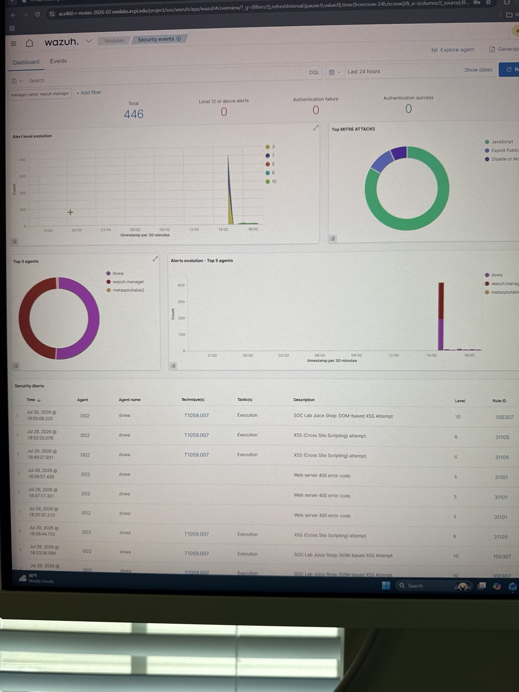
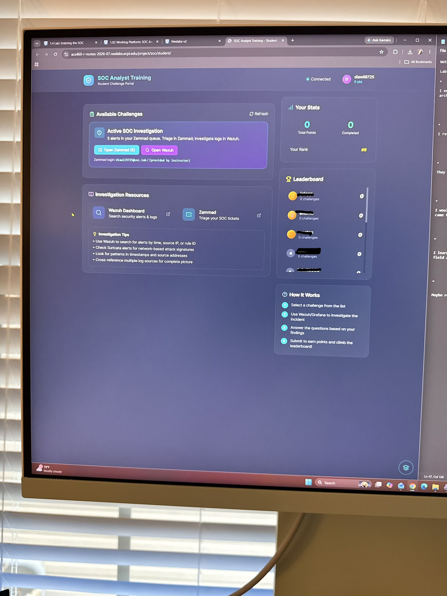
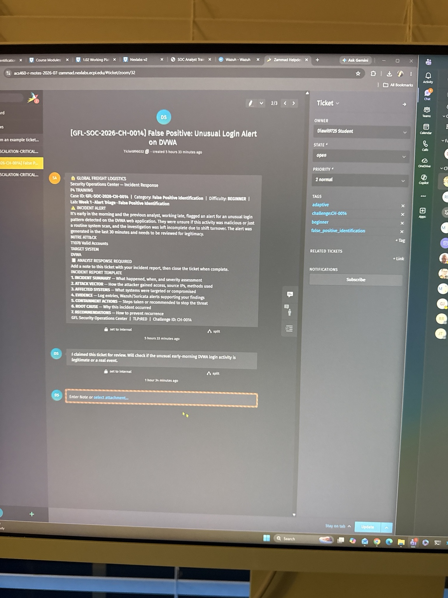
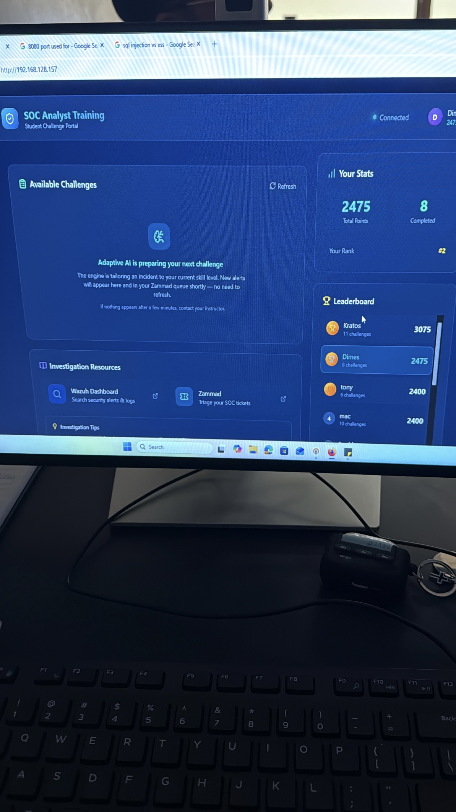
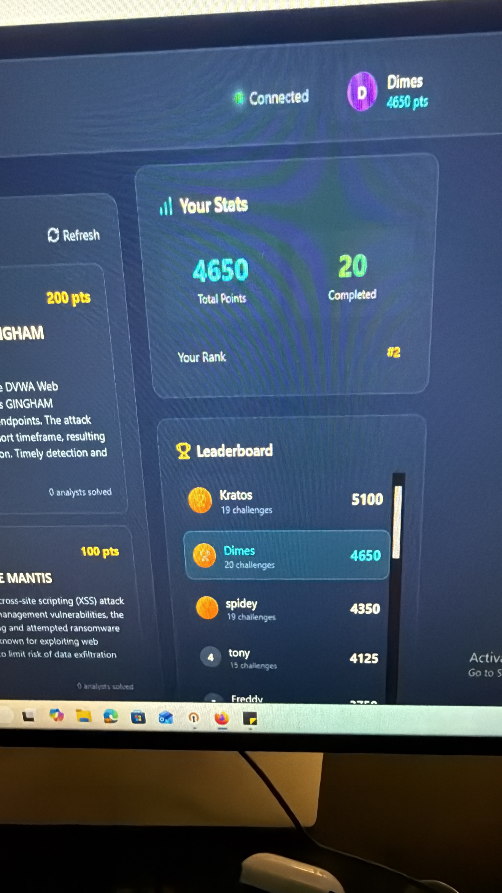

# 🛡️ Wazuh SOC Incident Investigation

This project highlights hands-on Security Operations Center (SOC) experience within an adaptive SOC training environment. The environment simulated an analyst workflow using Wazuh SIEM for security-event investigation, Zammad for ticket-based case management, Suricata telemetry for network correlation, and structured incident reporting.

The project demonstrates alert triage, threat hunting, evidence correlation, timeline reconstruction, MITRE ATT&CK mapping, incident classification, containment and recovery planning, and SOC case documentation.

## 🧠 Adaptive SOC Training Environment

The SOC environment used an adaptive workflow to generate and evaluate analyst ticket assignments.

Rather than providing identical incidents that directly mirrored each lab handout, the environment assigned SOC tickets based on the security skills and investigative competencies being developed. Specific hosts, IP addresses, indicators, and attack techniques could vary between assigned incidents.

Analysts were expected to investigate the evidence actually present in their assigned tickets and apply a consistent analytical process rather than force findings to match the example scenario.

The general investigation workflow included:

1. Receiving and triaging an assigned incident in Zammad
2. Identifying relevant indicators and investigation requirements
3. Searching Wazuh for related security events
4. Correlating endpoint and network evidence
5. Reviewing MITRE ATT&CK tactics and techniques
6. Reconstructing incident activity
7. Determining severity, confidence, and incident classification
8. Developing containment, eradication, and recovery recommendations
9. Documenting findings in the SOC investigation report
10. Closing the ticket for evaluation

## 🖥️ SOC Training Environment

### Wazuh SIEM

*Wazuh Security Events dashboard used to review alerts, agents, MITRE ATT&CK mappings, tactics, techniques, and rule activity.*

Wazuh was used throughout the investigations to search and correlate security telemetry, identify suspicious activity, review event data, and establish relationships between alerts.

### Adaptive SOC Platform

*SOC Analyst Training portal providing access to active investigations, Wazuh, Zammad, and investigation resources.*

The training portal connected the different components of the SOC workflow and provided access to dynamically assigned analyst challenges.

### Zammad Case Management

*Example Zammad SOC ticket containing an incident scenario, MITRE ATT&CK information, analyst response requirements, and investigation objectives.*

Zammad was used to receive, triage, document, and close assigned security incidents. Investigation notes, supporting evidence, screenshots, and completed incident reports were added to the corresponding cases.

## 🔎 Featured Incident Investigation

One advanced investigation required reconstructing suspicious activity affecting a Linux-based system after Wazuh generated alerts associated with authentication activity, privilege escalation, and possible defense evasion.

Rather than assuming the activity matched the accompanying lab scenario, the investigation followed the evidence available within the assigned SOC ticket and correlated relevant security telemetry.

### Investigation Findings

The investigation identified activity involving:

- Unauthorized SSH activity
- Root-level command execution
- Privilege escalation activity
- PAM session activity
- Log deletion and tampering
- Syslog manipulation
- Removal of a suspicious file
- Suspicious outbound network communication
- Multiple related Indicators of Compromise (IOCs)

The correlated activity supported classification of the incident as a **true positive / malicious security event**.

## ⏱️ Timeline Reconstruction

Wazuh events were analyzed chronologically to reconstruct the sequence of suspicious activity.

The investigation connected authentication activity with subsequent privileged commands, system-log manipulation, suspicious file activity, and network communication.

Evidence correlation included:

- Event timestamps
- Source and destination IP addresses
- Host information
- User accounts
- Wazuh rule IDs
- Authentication events
- File and process activity
- Network telemetry
- MITRE ATT&CK techniques

Timeline reconstruction helped distinguish individual alerts from the larger incident sequence and provided context for containment and recovery decisions.

## 🧭 MITRE ATT&CK Mapping

Observed activity was mapped to relevant MITRE ATT&CK techniques, including:

- **T1070 – Indicator Removal**
- **T1070.002 – Clear Linux or Mac System Logs**
- **T1562.001 – Impair Defenses: Disable or Modify Tools**

MITRE ATT&CK mapping provided additional context for understanding attacker behavior and communicating the significance of the observed activity.

## 🌐 Evidence Correlation

The investigation incorporated evidence from multiple security sources rather than relying on a single alert.

Sources included:

- Wazuh SIEM security events
- Raw event data
- Authentication and PAM activity
- Linux system events
- Suricata network telemetry
- Zammad incident tickets
- MITRE ATT&CK mappings

Correlating these sources helped establish a more complete picture of the incident and identify activity that may not have been significant when viewed independently.

## 🚨 Incident Response

Based on the evidence identified during the investigation, response actions and recommendations included:

- Isolating affected systems
- Blocking identified malicious infrastructure
- Preserving relevant evidence
- Escalating suspicious activity for additional analysis
- Reviewing suspicious files associated with the incident
- Rotating potentially compromised credentials
- Reimaging affected systems when appropriate
- Adding identified IOCs to monitoring and watchlists
- Increasing monitoring following recovery
- Strengthening authentication controls
- Reviewing SIEM detection coverage

The investigation emphasized connecting response recommendations directly to observed evidence rather than applying generic containment actions.

## 📄 SOC Reporting

A formal SOC Investigation Report was created to document the incident from identification through recovery.

The report included:

- Incident details
- Indicators of Compromise
- Investigation summary
- Timeline reconstruction
- MITRE ATT&CK mapping
- Severity and confidence assessment
- Containment actions
- Eradication recommendations
- Recovery recommendations
- Stakeholder communication
- Final incident classification
- Continued monitoring recommendations

The completed investigation received a **99/100 evaluation score** within the SOC training environment.

## 🏆 SOC Challenge Competition

The SOC Analyst program concluded with a ticket-based challenge competition using the same adaptive training environment.

Unlike earlier investigations that required formal incident reports, the competition focused on efficiently investigating and resolving assigned SOC tickets. The adaptive system generated new incidents based on analyst progress and skill level, requiring continued use of Wazuh and Zammad without a formal report template for each challenge.

### Adaptive Challenge Workflow

*The adaptive training engine preparing the next incident based on analyst skill level and progress.*

During the challenge competition, I:

- Completed **20 SOC investigation challenges**
- Earned **4,650 total points**
- Reached the **#1 analyst leaderboard position** during the competition
- Investigated progressively generated security incidents
- Continued using Wazuh SIEM and Zammad case management
- Applied evidence-correlation and threat-investigation skills in a more time-sensitive challenge format

### Competition Progress

*Competition progress showing 20 completed challenges and 4,650 total points.*

### Leaderboard

*Reached the #1 position on the SOC analyst leaderboard during the challenge competition.*

## 🛠️ Technologies & Skills

- Wazuh SIEM
- Zammad Case Management
- Suricata
- MITRE ATT&CK
- Security Alert Triage
- Threat Hunting
- Log Analysis
- Incident Investigation
- Timeline Reconstruction
- Evidence Correlation
- Indicator of Compromise Analysis
- Linux Security Events
- Authentication Analysis
- Privilege Escalation Analysis
- Defense Evasion Detection
- Network Telemetry Analysis
- Incident Classification
- Containment & Remediation
- Recovery Planning
- SOC Documentation
- Stakeholder Communication

## 📂 Repository Contents

This repository includes:

- **SOC Investigation Report** – Detailed documentation of the featured incident, including evidence, timeline reconstruction, MITRE ATT&CK mapping, IOCs, containment, recovery, and final analyst determination.
- **SOC Lab Documentation** – Supporting assignment documentation and investigation evidence from the adaptive SOC environment.
- **Environment Screenshots** – Examples of Wazuh, Zammad, and the SOC Analyst Training platform.
- **Challenge Competition Screenshots** – Evidence of analyst progress and performance during the culminating ticket-based SOC competition.

## 🎯 Project Outcome

This experience strengthened my ability to approach security alerts as interconnected pieces of evidence rather than isolated events. Working within an adaptive SOC environment required investigating the activity actually present in each assigned case, correlating multiple security data sources, reconstructing attacker behavior, and making evidence-based response decisions.

The combination of structured incident investigations and the culminating challenge competition provided hands-on experience with both detailed SOC case analysis and faster-paced ticket triage using Wazuh SIEM and Zammad.
